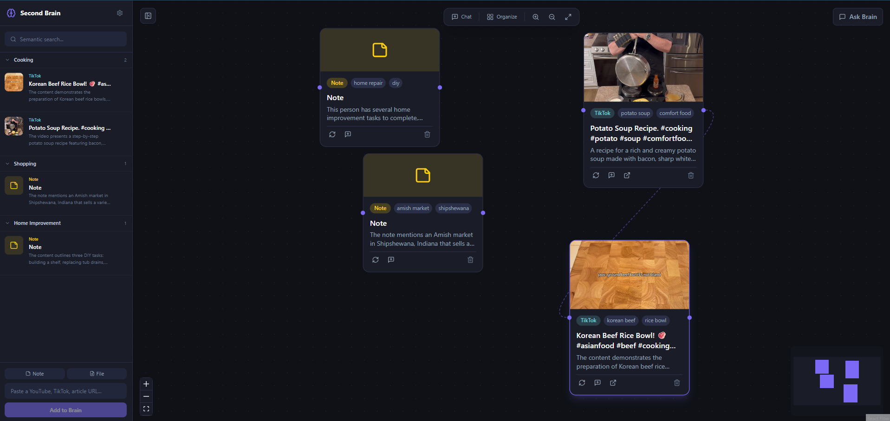
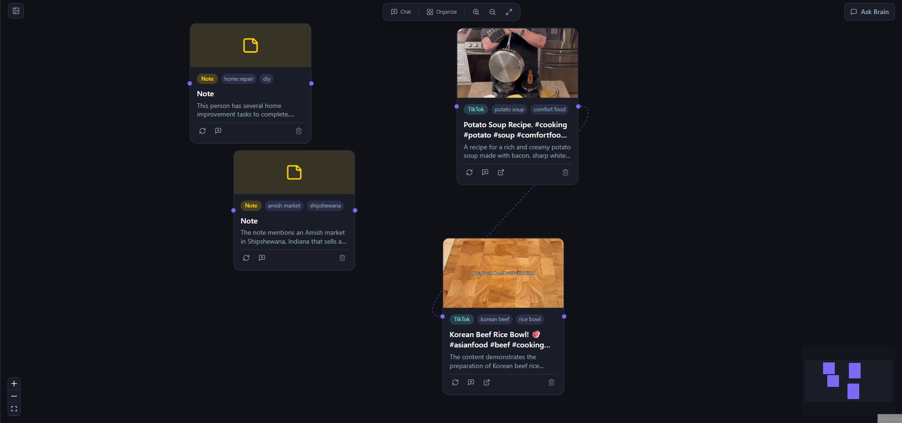
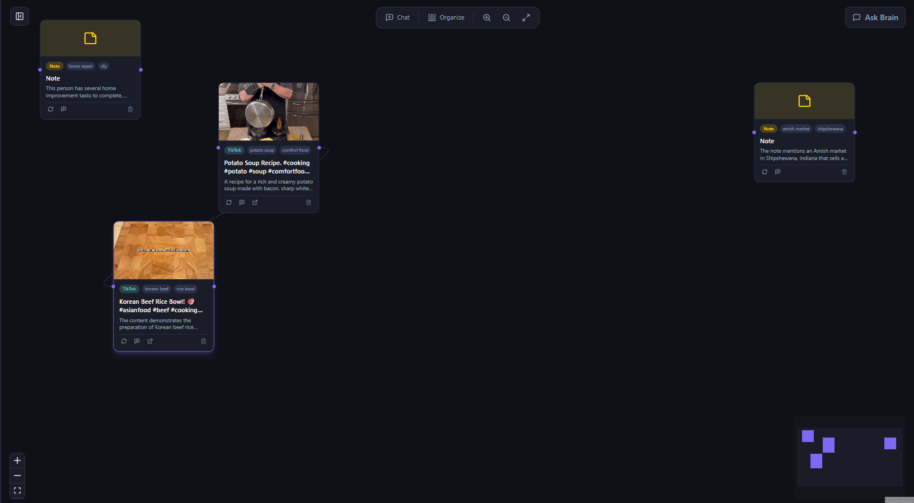
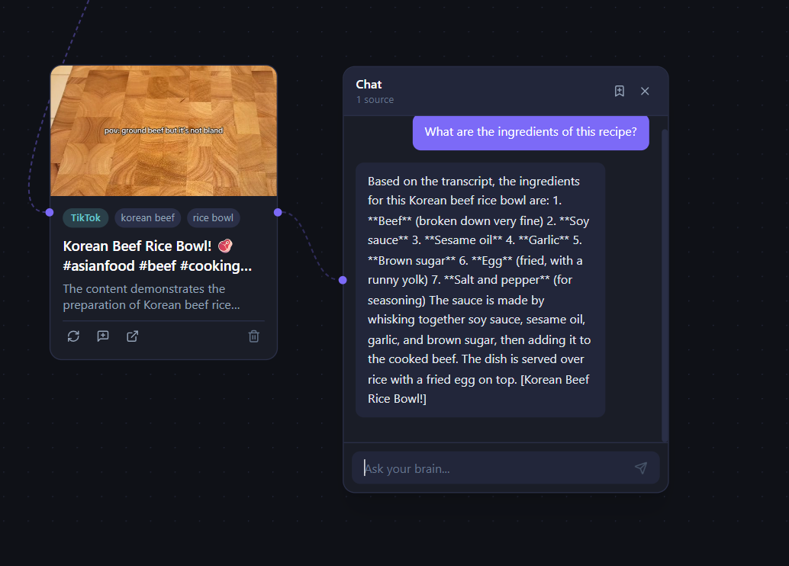
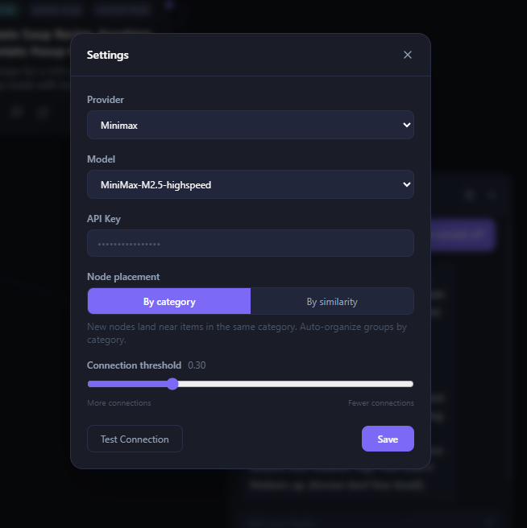

<div align="center">

# Second Brain

**A self-hosted, AI-powered knowledge base with an infinite canvas interface.**

Save anything. Find anything. Think in connections.

[](https://fastapi.tiangolo.com)
[](https://react.dev)
[](https://reactflow.dev)
[](https://www.trychroma.com)
[](LICENSE)

</div>

---

## What is Second Brain?

Second Brain is a local knowledge management tool that lets you ingest content from anywhere — YouTube, TikTok, articles, PDFs, podcasts, GitHub repos — and interact with it through AI-powered chat, semantic search, and an infinite spatial canvas.

Everything runs on your machine. Your data stays yours.

---

## Features

### Knowledge Capture
- **10 content types** — paste a URL or upload a file; the right extractor runs automatically
- **TikTok & Instagram** — captions extracted via yt-dlp; falls back to Whisper transcription when captions aren't available
- **Podcast transcription** — local Whisper model, no cloud required
- **PDF, GitHub, Google Docs** — full text extraction and indexing

### AI-Powered Understanding
- **Auto-tagging & categorization** — every item is automatically tagged, categorized, and summarized on ingest
- **Resummarize** — refresh any item's summary and tags on demand
- **Multi-provider AI** — bring your own key for MiniMax, Anthropic, OpenAI, or Gemini; switch providers without restarting
- **Streaming chat** — ask questions across your entire knowledge base with real-time streamed answers
- **RAG pipeline** — responses grounded in your actual content via ChromaDB semantic retrieval

### Infinite Canvas
- **Spatial thinking** — drag source nodes, chat windows, and pages onto an infinite board
- **Automatic semantic edges** — canvas items connect to each other automatically based on embedding similarity; no manual linking required
- **Typed manual connections** — draw your own edges between any two nodes and label the relationship: `related`, `source`, `inspired_by`, or `contradicts`
- **AI connection awareness** — when related items share connections, the RAG pipeline injects those relationships into the AI's context so answers reflect your explicit knowledge graph
- **3D mind map** — launch an interactive 3D force-directed graph of your entire knowledge base; orbit and fly through it with mouse + W/S keys
- **Chat nodes** — floating chat windows you can pin to specific source nodes to scope the AI's context
- **Page nodes** — save any conversation as a persistent, editable note on the canvas

### Navigation & Interface
- **Resizable panels** — drag to resize the sidebar and chat panel independently
- **Keyboard shortcuts** — `Ctrl/Cmd+B` toggles the sidebar; `Ctrl/Cmd+I` opens the brain chat panel

### Library & Navigation
- **Grouped library** — items organized into AI-generated categories, collapsed by default for a clean view
- **Semantic search** — find content by meaning, not just keywords
- **Inline tag editing** — add or remove tags on any item directly from the detail panel

### Settings & Configuration
- **In-app settings** — configure your AI provider, model, and API key from the UI; no `.env` editing required
- **Automatic backup** — settings are saved to `data/config.json` with automatic `.bak` backup before every write
- **Connection testing** — test your API credentials before saving

---

## Supported Content Types

| Type | Extraction Method |
|---|---|
| YouTube | Transcript via `youtube-transcript-api` · metadata via `yt-dlp` |
| TikTok | Captions via `yt-dlp` · Whisper audio fallback |
| Instagram Reels | Caption + metadata via `yt-dlp` |
| Podcasts | Audio download via `yt-dlp` · local Whisper transcription |
| Articles & Web Pages | Clean text extraction via `trafilatura` |
| PDFs | Text extraction via `PyMuPDF` |
| GitHub Repositories | Clones repo, indexes README + source files |
| Google Docs | Google Drive API (one-time OAuth setup) |
| LinkedIn Posts | Paste content directly (scraping blocked by LinkedIn) |
| Plain Notes | Type or paste any text |

---

## Supported AI Providers

Configure your preferred provider from the in-app settings panel. No restart required.

| Provider | Models | SDK |
|---|---|---|
| **MiniMax** | MiniMax-M2.5, MiniMax-M2.5-highspeed | Anthropic-compatible |
| **Anthropic** | claude-opus-4-6, claude-sonnet-4-6 | Anthropic SDK |
| **OpenAI** | gpt-4o, gpt-4o-mini | OpenAI-compatible |
| **Gemini** | gemini-2.0-flash, gemini-1.5-pro | OpenAI-compatible |

---

## Getting Started

### Windows Installer (recommended for non-developers)

1. Download `SecondBrain-Setup.exe` from the [latest release](../../releases/latest)
2. Run it and follow the prompts — Python and all dependencies install automatically
3. A Notepad window will open during setup — paste your API key and save
4. Click the **Second Brain** shortcut on your desktop or Start Menu

Your browser opens automatically. A tray icon in the taskbar lets you reopen the app or quit.

> **First launch:** the local AI models (~500 MB total) download once and are cached. This takes a few minutes depending on your internet speed.

---

### Docker (recommended for self-hosting and developers)

```bash
git clone https://github.com/triss-smith/mysecondbrain.git
cd mysecondbrain

cp .env.example .env  # add your API key
docker-compose up
```

Open **http://localhost:5173** in your browser.

Configure your AI provider from the **⚙ gear icon** in the sidebar — no restart required.

> **First run:** the local embedding model (~90 MB) downloads and is cached. Whisper (~150 MB) downloads on first podcast or TikTok ingest.

---

### Contributing

See [CONTRIBUTING.md](CONTRIBUTING.md) for local development setup (hot-reload, manual backend/frontend workflow).

---

### Building a Release (Windows installer)

Requires [Inno Setup 6](https://jrsoftware.org/isdl.php) on a Windows machine.

```bat
installer\build.bat
```

Produces `dist\SecondBrain-Setup.exe`. Upload as a GitHub release asset — users run it with no prerequisites.

> First build downloads the Python 3.12 embeddable (~25 MB) and caches it; subsequent builds skip that step.

---

## How It Works

```
1. Paste a URL or upload a file
         ↓
2. Backend detects content type → routes to the correct ingestor
   (yt-dlp, Whisper, trafilatura, PyMuPDF, gitpython, etc.)
         ↓
3. Raw content extracted (transcript, article text, PDF pages, etc.)
         ↓
4. AI generates tags, a category, and a summary
   sentence-transformers embeds chunked text → stored in ChromaDB
   Metadata + content saved to SQLite
         ↓
5. Item appears in the Library sidebar, grouped by category
   Drag it onto the infinite canvas as a Source node
         ↓
6. Semantic edges appear automatically between related Source nodes
         ↓
7. Open a Chat node, optionally pin Source nodes to scope context
         ↓
8. Ask a question → top-K chunks retrieved from ChromaDB
   → AI synthesises a grounded answer, streamed back live
         ↓
9. Save the conversation as a Page node on the canvas
```

---

## Canvas Node Types

| Node | Description |
|---|---|
| **Source** | A saved knowledge item — thumbnail, type badge, tags, summary, and a resummarize button |
| **Chat** | Floating chat window; pin Source nodes to scope the AI's knowledge to specific items |
| **Page** | Editable rich-text note; created automatically when you save a conversation |

Semantic edges between Source nodes are drawn automatically — no configuration needed. Edge weight reflects embedding similarity; unrelated items stay disconnected. You can also draw manual typed edges between any nodes to capture relationships the AI didn't infer.

---

## Screenshots

### Library & Capture
<!-- Screenshot: full app window. Sidebar on the left showing 2–3 expanded category groups (e.g. "Cooking", "Software Engineering") each with 2–3 items. Each item shows its thumbnail, source badge (TikTok/YouTube/Article), title, and a one-line summary snippet. The semantic search bar is visible at the top of the sidebar. The URL input field at the bottom of the sidebar is empty and ready to use, with the "Note" and "File" buttons beside it. The canvas in the background is visible but unfocused. -->


### Infinite Canvas
<!-- Screenshot: the full canvas view (no sidebar, or sidebar collapsed). 4–6 Source nodes visible — each showing a thumbnail image, a coloured source badge (e.g. TikTok, YouTube), 2–3 tag pills, and a short summary. Dashed purple lines connect related nodes, with varying opacity (brighter = more similar). At least one pair of nodes should have a "%" similarity label on the edge. The toolbar is visible at the top-centre with the Chat, Organize, and zoom buttons. The MiniMap is in the bottom-right corner. -->


### Smart Node Placement & Auto-Connections
<!-- Screenshot: canvas zoomed in to show two groups of nodes clearly separated by category. For example, 3 Cooking nodes arranged in a tight horizontal row, connected by bright dashed purple edges between them. A second group (e.g. Software Engineering) is offset to the right or below, also connected internally. Shows that same-category nodes are placed adjacent to each other and that related items are automatically linked. -->


### AI Chat
<!-- Screenshot: a Chat node open on the canvas, showing a 2–3 turn conversation. The question should be something specific to the content (e.g. "What ingredients do I need?"). The AI's answer is visible and references actual content. One or two Source nodes are visually connected to the Chat node (dashed lines from source to chat). The chat node's title bar and close/save buttons are visible at the top of the node. -->


### Settings
<!-- Screenshot: the Settings modal open and centred over the app. Shows the Provider dropdown (e.g. "Anthropic" selected), Model dropdown (e.g. "claude-sonnet-4-6"), the API Key field with masked dots. Below that, the Canvas section: Node placement toggle with "By category" or "By similarity" highlighted, and the Connection threshold slider positioned at around 0.30 with the "0.30" label visible. The "Test Connection" and "Save" buttons are visible at the bottom. -->


---

## Google Docs Setup

1. Create a project in [Google Cloud Console](https://console.cloud.google.com)
2. Enable the **Google Docs API** and **Google Drive API**
3. Create OAuth 2.0 credentials (Desktop app type)
4. Download the credentials JSON → save as `data/google_credentials.json`
5. On first use, visit `/api/auth/google` to complete the OAuth flow — the token is saved to `data/google_token.json` automatically

---

## Environment Variables

`.env` values serve as fallback defaults. Settings saved via the UI always take precedence.

| Variable | Required | Default | Description |
|---|---|---|---|
| `MINIMAX_API_KEY` | No¹ | — | Fallback API key (any provider key works here) |
| `MINIMAX_MODEL` | No | `MiniMax-M2.5` | Fallback model name |
| `EMBED_MODEL` | No | `all-MiniLM-L6-v2` | Local sentence-transformers model |
| `DB_PATH` | No | `data/brain.db` | SQLite database path |
| `CHROMA_PATH` | No | `data/chroma` | ChromaDB storage path |
| `UPLOADS_PATH` | No | `data/uploads` | Uploaded file storage |
| `HOST` | No | `0.0.0.0` | Backend bind host |
| `PORT` | No | `8000` | Backend port |
| `GOOGLE_CLIENT_ID` | No | — | Google Docs ingestion |
| `GOOGLE_CLIENT_SECRET` | No | — | Google Docs ingestion |

¹ Required only before you configure a provider via the in-app settings panel.

---

## Data & Privacy

- **All storage is local** — SQLite database and ChromaDB vector store live in `data/` on your machine
- **Embeddings run locally** — sentence-transformers never sends data to an external service
- **AI API calls** — only the text you submit for chat or tagging is sent to your chosen AI provider
- **No telemetry** — no analytics, no tracking, no phone-home

---

## Notes

- **LinkedIn** — automated ingestion is blocked by LinkedIn's anti-scraping measures; paste post content directly as a note instead
- **Whisper models** — the `base` model is used by default (~150 MB, downloads on first use); larger models give better accuracy but are slower
- **Google Docs** — requires a one-time OAuth browser flow; subsequent ingests use a cached token
